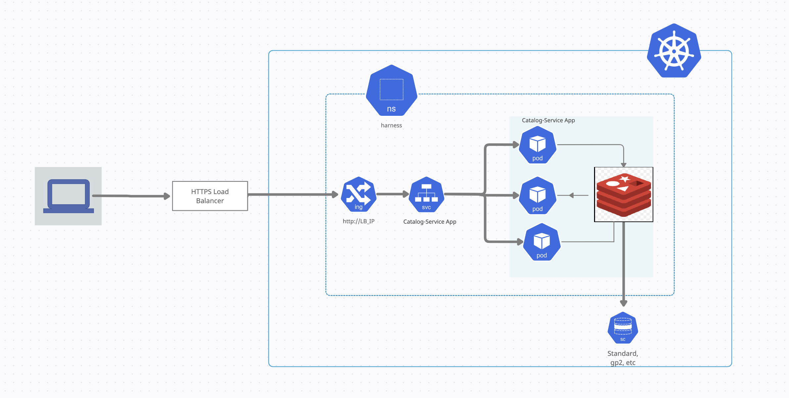

### Overview
I have used Ranchor Desktop to create development environment and dockerize this application. I have made a small change in **main.py** file to pass in **REDIS_HOST** as an environment variable or else we could run python and redis in the same pod to communicate over **localhost:port**

#### Tools
- Ranchor Desktop
- kustomize
- docker

### Probes
A probe is a periodic check that monitors the health of an application. I have applied the following probes for catalog application as well as redis.

1. Startup Probe
2. Readiness Probe
3. Liveness Probe

>**CRITICAL**
Please remove readiness and liveness probes from app.yaml before deploying catalog-service. These probes are of type **httpGet** and are failing at port **8000**.

Given the situation that, we need to deploy our application in development, staging and production environment. I have created a directory structure in **kustomize**

I have assumed the following resource allocation for development, staging and production and we can change them according to our requireents:

| Environment    |  Pods  |  Memory   |  CPU Limit  |
| ---------------| -------|-----------|-------------|
| Development    |    1   |   128Mi   |   250m      |
| Staging        |    2   |   256 Mi  |   500m      |                                                                       
| Production     |    5   |   512 Mi  |   1000m     |    

>**Note**
I personally like to use **horizontalpodautoscaling** feature of kubernetes to effectively manage resource consumption. We can use the following command for **horizontalpodautoscaling**

    kubectl autoscale deployment/deployment-name --min=2 --max=5 --cpu-percent 80

Please follow the following steps to deploy application in different environment. Change your directory to kustomize ...

#### Steps:-
1. Clone the GitHub repository 
    git clone https://github.com/manish-jangra/shypple.git
    
2. Change directory to **shypple**
    ```
    cd shypple
    ```

3. Remove Readiness and Liveness Probe from app.yaml. This needs further troubleshooting to get this working. All the probes are working for redis deployment

4. Run one of the following command depending on your environment.
    ```
    kubectl apply -k overlays/development               # for development environment
    kubectl apply -k overlays/staging                   # for staging environment
    kubectl apply -k overlays/production                # for production environment
    ```
5. Validate that all pods are running.

6. If deploying in development environment. Please use port-forwarding option
    ```
    kubectl port-forward service/shypple 8000:30007
    ```
7. If you're deploying in Managed Kubernetes or one prem kubernetes cluster. Please use the following **YAML** file to create **ingress-controller**
```YAML
apiVersion: networking.k8s.io/v1
kind: Ingress
metadata:
  name: ingress
spec:
  defaultBackend:
    service:
      name: shypple
      port:
        number: 8000
```
8. If you're using RedHat OpenShift version of kubernetes. Please run the following command ..
    ```oc expose svc/shypple
    ```

    **OR**
    
    Deploy route.yaml from directory **overlays/openshift**

>**Note** route.openshift.io/v1 is an openshift service and ingress is native kuberenetes service

#### Application Architecture for GCP
